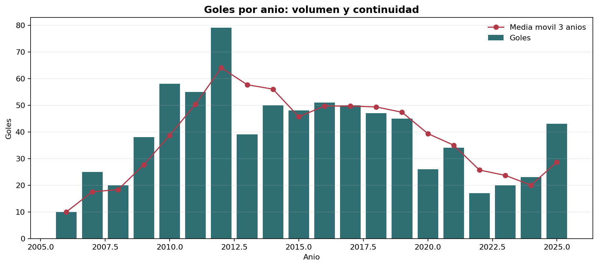
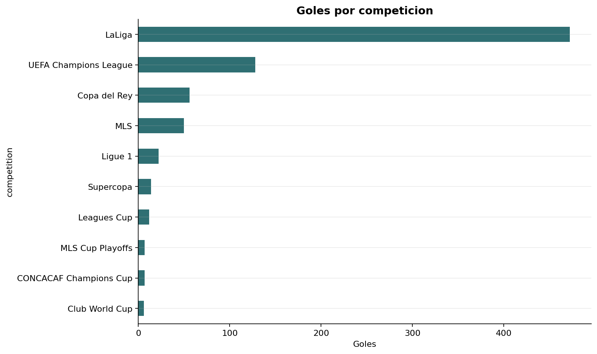
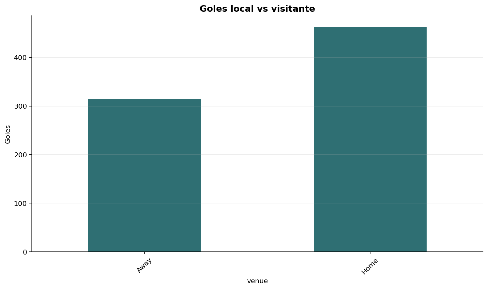
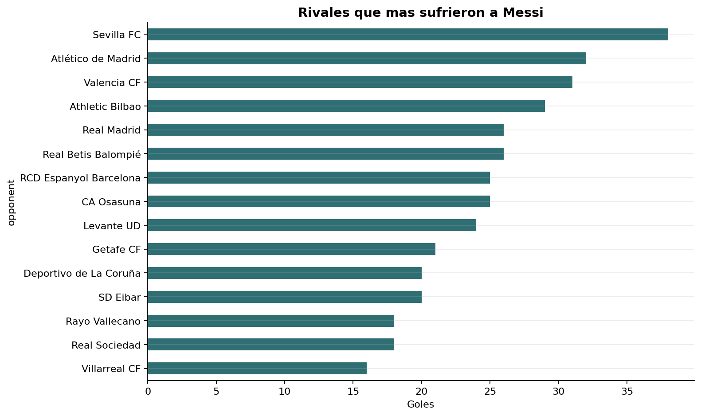
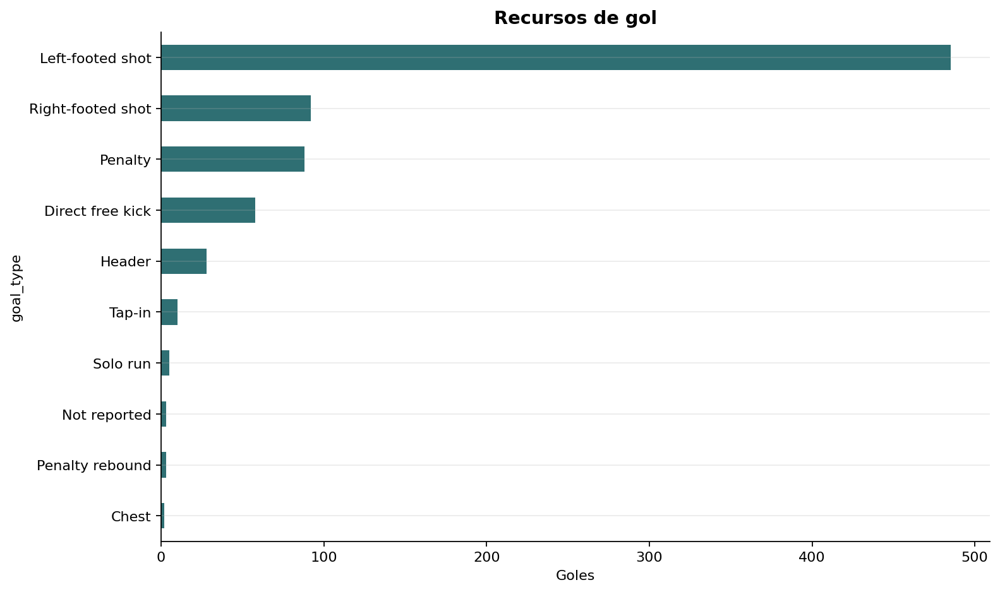
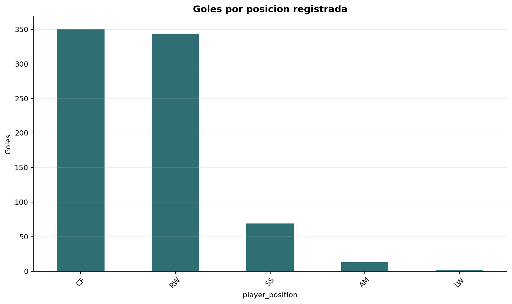
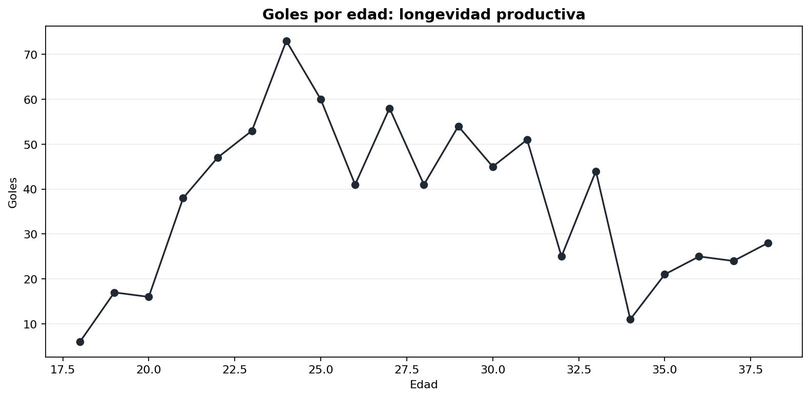
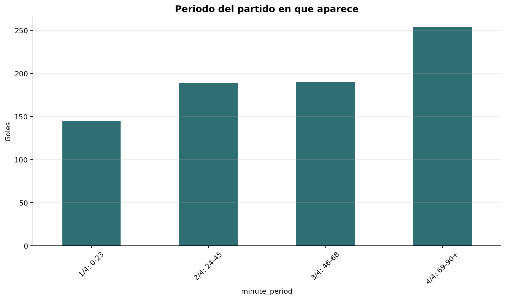

# Por que Messi es considerado el GOAT?

Este EDA analiza los goles oficiales de Lionel Messi entre 2006 y 2025, excluyendo Barcelona B para enfocarse en su carrera profesional principal. La respuesta corta es: Messi es considerado el GOAT porque combina volumen historico, continuidad, adaptacion tactica, variedad de recursos y aparicion en momentos decisivos.

Dataset limpio: `data/processed/messi_goals_clean.csv`  
Graficos: `outputs/figures/`  

## 1. Goles por anio: se mantiene en el tiempo?

Messi suma **778 goles** en el periodo analizado. Su pico aparece en **2012 con 79 goles**, pero lo mas importante no es solo el pico: entre 2010 y 2019 sostiene casi siempre temporadas de elite, con varios anios por encima de 45 goles.

El dato que mas pesa para responder la pregunta principal es la continuidad. No fue un jugador de una temporada excepcional: sostuvo produccion goleadora durante casi dos decadas, incluso cambiando de edad, contexto, liga y club.

## 2. Goles por competicion: donde construye su dominio?

La mayor parte de sus goles aparecen en **LaLiga: 472 goles**. Despues viene la **UEFA Champions League: 128 goles**, seguida por Copa del Rey, MLS y Ligue 1.

Esto tiene logica futbolistica: su etapa mas larga y dominante fue en Barcelona, enfrentando cada anio a rivales espanoles. Pero el volumen en Champions confirma que no es solo dominio local: tambien produjo en la competencia de clubes mas exigente de Europa.

Primeras competiciones en las que aparece:

| Competicion | Primer gol |
| --- | --- |
| LaLiga | 2006-01-15 |
| Copa del Rey | 2006-02-01 |
| UEFA Champions League | 2006-09-27 |
| Supercopa | 2009-08-23 |
| Club World Cup | 2009-12-16 |

## 3. Local vs visitante: le pesa jugar afuera?

Messi convierte **463 goles de local** y **315 de visitante**. La diferencia existe, pero no indica que le pese jugar afuera: el 40,5% de sus goles llegan como visitante.

En un deporte donde el local suele atacar mas, tiene mas control territorial y mejores condiciones emocionales, sostener mas de 300 goles de visitante refuerza la idea de jugador trasladable: produce tambien fuera de su entorno mas favorable.

## 4. Rivales: a que equipos les marco mas?

El rival al que mas le marco fue **Sevilla FC con 38 goles**. Luego aparecen Atletico de Madrid, Valencia, Athletic Bilbao, Betis, Real Madrid, Osasuna y Espanyol.

Tiene logica que dominen equipos espanoles: Messi jugo la mayor parte de su carrera en LaLiga. Tambien es relevante que en la lista aparezcan rivales fuertes como Atletico de Madrid y Real Madrid, lo que evita una lectura simple de "solo marco contra equipos menores".

## 5. Variacion de goles: que recursos posee?

Su recurso dominante es el **remate de zurda: 485 goles**, equivalente al 62,3%. Pero el dataset tambien registra goles de derecha, penal, tiro libre directo, cabeza, jugada individual y otros recursos.

La conclusion no es que Messi sea simetrico, sino que su especializacion es devastadora y esta acompanada por suficientes recursos alternativos para no depender de una sola situacion de partido.

## 6. Posicion: varia donde puede jugar?

Las posiciones con mas goles son **CF** y **RW**, casi empatadas: 351 como centrodelantero y 344 como extremo derecho. Tambien aparecen goles como segundo delantero, mediapunta y extremo izquierdo.

Esto refuerza una parte central del argumento GOAT: Messi no fue solo un definidor. Su produccion se sostiene desde zonas distintas, con evolucion desde banda derecha hacia roles mas centrales y libres.

## 7. Goles por edad: la edad baja su rendimiento?

El pico por edad aparece a los **24 anios con 73 goles**, pero la curva no se derrumba despues. Hay produccion alta a los 27, 29, 30, 31 y 33 anios, y todavia registra goles entre los 36 y 38.

La edad afecta el contexto fisico, pero en los datos no aparece como una caida lineal simple. Messi adapta su juego: menos dependencia de explosion pura y mas peso de lectura, definicion, pelota parada y toma de decisiones.

## 8. Momento del partido: el cansancio le afecta?

El periodo con mas goles es el **ultimo cuarto del partido: 254 goles entre el minuto 69 y el 90+**, el 32,6% del total.

Esto es un indicador fuerte. Si el cansancio lo afectara de forma decisiva, esperariamos una caida al final. En cambio, Messi aparece mas en el cierre, cuando los espacios, la presion y la fatiga suelen condicionar mas el partido.

## 9. Clutch: sus goles cambian partidos?

El analisis marca como clutch los goles que empatan cuando su equipo iba perdiendo o ponen a su equipo arriba cuando el partido estaba empatado. Con ese criterio aparecen **350 goles clutch**:

- **275** goles pusieron a su equipo en ventaja desde un empate.
- **75** goles empataron un partido que su equipo iba perdiendo.

Ejemplos del dataset:

| Fecha | Rival | Competicion | Minuto | Marcador tras el gol | Resultado final |
| --- | --- | --- | ---: | --- | --- |
| 2006-09-27 | SV Werder Bremen | UEFA Champions League | 89 | 1:1 | 1:1 |
| 2007-03-10 | Real Madrid | LaLiga | 91 | 3:3 | 3:3 |
| 2011-05-28 | Manchester United | UEFA Champions League | 54 | 2:1 | 3:1 |
| 2014-03-23 | Real Madrid | LaLiga | 84 | 3:4 | 3:4 |
| 2017-04-23 | Real Madrid | LaLiga | 92 | 2:3 | 2:3 |

## Conclusion

Messi es considerado el GOAT porque los datos muestran una combinacion muy dificil de igualar:

- Volumen: 778 goles analizados.
- Regularidad: produccion alta durante casi veinte anios.
- Escenario: dominio en liga y peso enorme en Champions.
- Adaptabilidad: goles desde varias posiciones y en distintas etapas de edad.
- Recursos: zurda dominante, pero tambien penales, tiros libres, derecha, cabeza y jugadas individuales.
- Resistencia competitiva: mayor aparicion en el tramo final de los partidos.
- Impacto: 350 goles que empatan o ponen a su equipo en ventaja.

El argumento no depende de un solo grafico. Messi es GOAT porque el dominio aparece en muchas dimensiones al mismo tiempo: cantidad, duracion, contexto, versatilidad y momentos decisivos.
